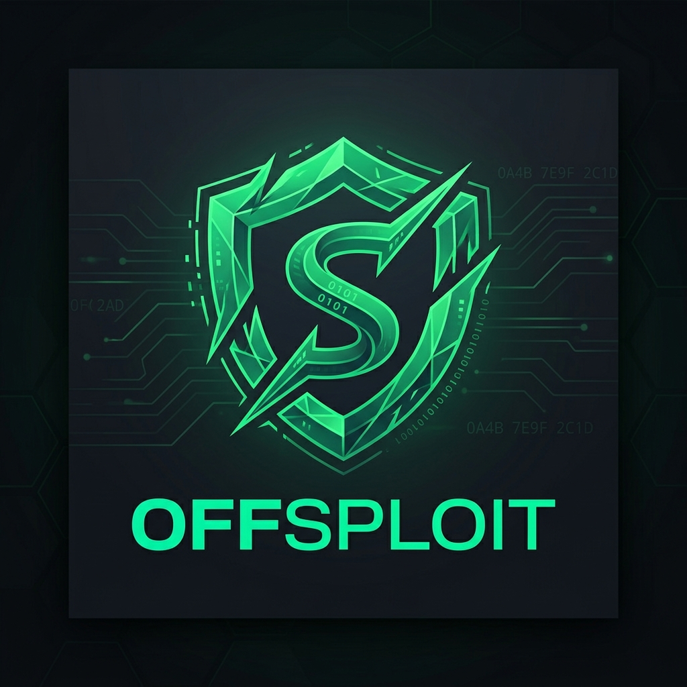

<div align="center">
  
  <h1>OffSploit WebSite</h1>
  <p><strong>Autonomous Exploit Adaptation & C2 Framework Landing Page</strong></p>
</div>

## Overview

This is the official website and landing page for **OffSploit** – an advanced autonomous Red Team tool using RAG and local LLMs to dynamically adapt exploits, bypass OPSEC, and act as a C2 Framework in air-gapped environments.

Built with React, Vite, and Framer Motion, this website offers a premium, glassmorphism-inspired dark theme fitting for offensive security researchers and Red Team operators.

## Deployment (Vercel)

This website is fully optimized for Vercel deployment out-of-the-box. 
1. Connect your GitHub repository to Vercel.
2. Framework Preset: **Vite**
3. Build Command: `npm run build`
4. Output Directory: `dist`
5. Deploy!

## Local Development

To run this project locally on your machine:

```bash
# Clone the repository
git clone https://github.com/egnake/OffSploit_WebSite.git
cd OffSploit_WebSite

# Install dependencies
npm install

# Start the Vite development server
npm run dev
```

## UI & SEO Features
- **Premium Glassmorphism UI**: High-end dark theme with modern typography and glowing accents.
- **Micro-Animations**: Smooth scroll effects, dynamic backgrounds, and component mounting via Framer Motion.
- **i18n Support**: Seamlessly switch between English and Turkish languages.
- **SEO Optimized**: Advanced meta tags, OpenGraph, and Twitter Cards ready for high-ranking indexing.

## Legal Disclaimer

OffSploit is developed strictly for authorized penetration testing, Red Team operations, and educational purposes. The use of this tool against systems without explicit, prior consent is illegal and strictly prohibited. The developer (egnake) assumes no liability and is not responsible for any misuse or damage caused by this framework.
